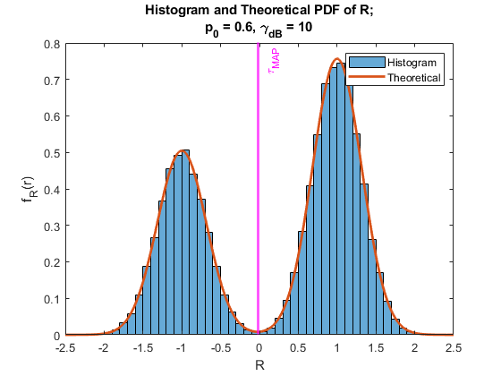

# Introduction

## Purpose and Scope
This section provides a brief description of the Systems Design Document’s purpose and scope.

## Project Executive Summary
This section provides a description of the project from a management perspective and an overview of the framework within which the conceptual system design was prepared.  If appropriate, include the information discussed in the subsequent sections in the summary.

### System Overview
This section describes the system in narrative form using non-technical terms.  It should provide a high-level system architecture diagram showing a subsystem breakout of the system, if applicable.  The high-level system architecture or subsystem diagrams should, if applicable, show interfaces to external systems.  Supply a high-level context diagram for the system and subsystems, if applicable.

### Design Constraints
This section describes any constraints in the system design (reference any trade-off analyses conducted such, as resource use versus productivity, or conflicts with other systems) and includes any assumptions made by the project team in developing the system design.

### Future Contingencies
Test

## Document Organization
Test

## Points of Contact
Test

## Project References
Test

## Glossary
Test

# System Architecture
Test

## System Hardware Architecture
Test

## System Software Architecture
Test

## Internal Communications Architecture
Test

# File and Database Design
Test

## Database Management System Files
Test

## Non-Database Management System Files
Test

# Human-Machine Interface
Test

## Operational Scenario(s)
Test

## Inputs
Test

## Outputs
## Hardware Used

This section will cover all hardware components included in the UHDRTZ kit. It will also cover basic setup and descriptions of the comonents for a more in depth explination of how to use them. The components covered are as followed.

- 4K USB-C Camera
- Mini PC
- Crank Housing
  - Aduino
  - Rotary Encoder

### 4K USB-C Camera

The Camera used for this project will be the Econ Systems See3CAM_CU135. This camera has one USB-C 3.0 port. It has a 13MP fixed lens with good low light performance and iHDR support. This camera was chosen for this project due to its small form factor and easy setup.

- **Key Features**
  - **Frame Rate:**
    - Full HD @ 60 fps, 4k @ 30 fps & VGA @ 120 fps
    - Up to 816 fps for Custom ROI*
      - Refer to the datasheet for complete frame rate details. <https://www.e-consystems.com/4k-usb-camera.asp>
    - Output format: Uncompressed UYVY and Compressed MJPEG
    - Supported OS: Windows, Linux, Android ** and MAC ***
    - iHDR support
    - Unique ID for each camera
  - **Interface:**
    - USB 3.1 Gen 1
    - Type-C reversible interface connector
    - UVC compliant - no additional drivers required
    - Backward compatible with USB 2.0 hosts
  - **Module Features:**
    - Sensor: AR1334 from onsemi&reg;
    - Focus Type: Fixed focus
    - Sensor Resolution: 13MP
    - Chroma: Color
    - Shutter Type: Electronic Rolling Shutter with global reset mode #
    - Optical Formal: 1/3.2"
    - Output Format: Uncompressed UYVY and Compressed MJPEG
    - Pixel Size: 1.1 $\mu m$ x 1.1 $\mu m$
    - Sensor Active Area: 4208 (H) x 3210 (V)
    - Array Size: 4280 x 3120 Pixel
    - Responsivity: 4700 e-/lux-sec
    - SNR: 37 dB
    - Dynamic Range: 69 dB (nice)
    - FOV: 67&deg;(D), 56&deg;(H), 43&deg;(V) (with the lens provided by e-con)
  - **Electrical and mechanical:**
    - Operating Voltage: 5 v +/- 5%
    - Operating Temerature Range: Without Enclosure: -30&deg;C to 70&deg;C
    - Power Requirements: Max: 1.99W, Min: 1.04W
    - SIze in mm (l x b h):
      - Without Lens: 35.3 x 35.3 x 29 mm
    - Board Weight:
      - Without Lens: 55.5 Grams
      - With Lens: 63.5 Grams
  - Miscellaneous:
    - Compliance: FCC, RoHS

*- Not supported by default. Requires firmware customization for higher framerates with Custom ROI resolutions.

**- Customers interesed to work on Android would require e-con SDK

***- For MAC OS support please contact camerasolutions@e-consystems.com

#- Rolling shutter is supported in the default firmware. Customized firmware/hardware is required to use a rolling shutter with Global reset mode.

### Mini PC

The Mini PC used in this project is the GMKtec Intel 11th i5 1135G7 Mini PC--NucBox 2 Plus.

- OS: Debian 11
- CPU: Intel 11th i5 1135g7
- Graphics: Intel&reg; Iris&reg; Xe Graphics
- RAM: 16GB DDR4 3200 MHz
- Memory: 512GB NVMe SSD
- Wi-Fi: Wi-Fi 6, BT 5.2
- Ports:
  - 1x Type-C Thunderbolt 4
  - 2x HDMI 2.0 (4k@60Hz)
  - 4x USB-A 3.2
  - 1x RJ45 Ethernet Port

### Crank Housing
The crank houseing will hold the arduino and rotary encoder. A wheel will be attached to the rotary encoder to allow for the user to turn the crank. The arduino will be used to read the encoder and send the data to the mini pc.

- Arduino
  - Arduino Nano 33 BLE
  - Microcontroller: nRF52840
  - Operating Voltage: 3.3V
  - Input Voltage (recommended): 7-12V
  - Input Voltage (limit): 6-20V
  - DC Current per I/O Pins: 15 mA
  - Clock Speed: 64 MHz
  - CPU Flash Memory: 1MB (nRF52840)
  - SRAM: 256KB (nRF52840)
  - EEPROM: none
  - Digital I/O Pins: 14
  - PWM Pins: all digital pins
  - UART: 1
  - SPI: 1
  - I2C: 1
  - Analog Input Pins: 8 (ADC 12 bit 200 ksamples)
  - Analog Output Pins: Only Through PWM (no DAC)
  - External Interrupts: all digital pins
  - LED_BUILTIN: 13
  - USB: Native in the nRF52840 Processor
  - Length: 45 mm
  - WidthL 18 mm
  - Weight: 5 gr (with headers)
- Rotary Encoder
  - Model: KY-040
  - Type: Incremental Rotary Encoder
  - Cycles per revolution (CPR): 20
  - Working voltage: 0 - 5V
  - Material: PCB + Brass
  Dimensions: 32 x 19 x 30 mm

In the case that the Arduino becomes detatched from the Rotary encoder, please refer to the following diagram for reconnection. 


# Detailed Design
Test

## Hardware Detailed Design
Test

## Software Detailed Desgin
Test

## Internal Communications Detailed Design
Test

# External Interfaces
Test

## Interface Architecture
Test

## Interface Detailed Design
Test

# System Integrity Controls
The system does not use any information that could affect the conduct of state programs or the privacy to which individuals are entitled. Thus, this section is not applicable.

# Appendices

# Test

## Test with vanilla md image


## Test of raw html figure
```{=html5}
<figure>
    
    <figcaption><b>Figure 1:</b> A festive guy</figcaption>
</figure>
```
