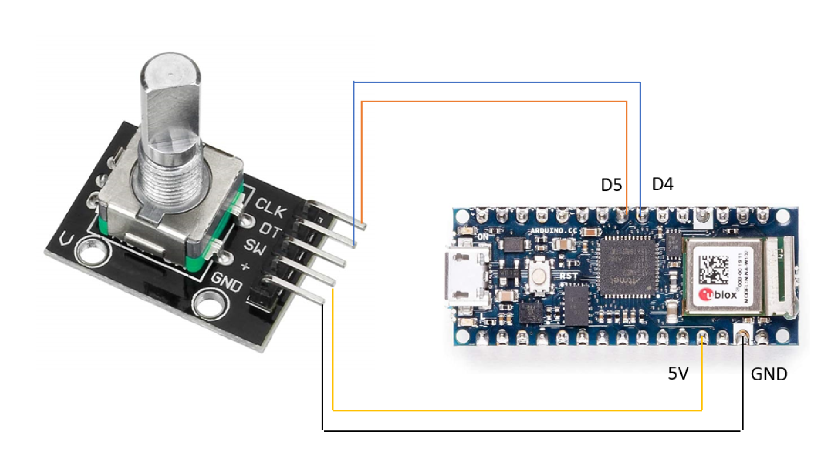
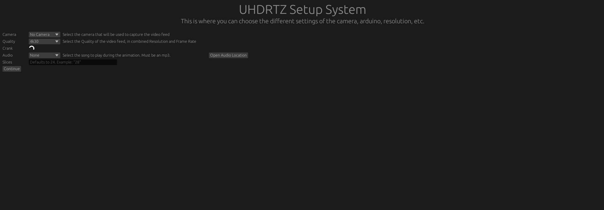
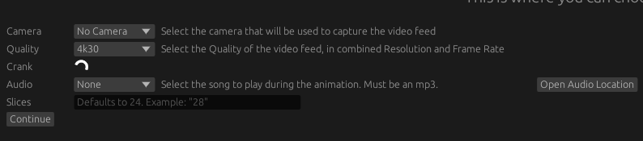
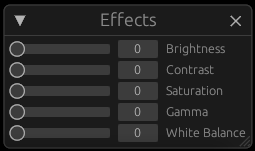
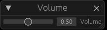

# Introduction

## Purpose and Scope

This document describes the design of the UHDRTZ system, including a description of the hardware and software architecture. There are also guidelines for setting up and using the system.

## Project Executive Summary

The Ultra Hi-Definition Real Time Zoetrope (UHDRTZ) is an interactive art installation based around a disc-shaped artwork that appears to animate when rotated at the correct speed. This project is an improvement to an existing system, originally released as the Real Time Zoetrope (RTZ), followed by two HD revisions HDRTZ and HDRTZ2. The software is stored and managed on GitHub, and we use our Mini PC to compile and run the program.

### System Overview

To achieve the desired zoetrope animation, a live video feed of the artwork is rotated digitally. The speed and direction of rotation is controlled by a hand crank. An overview of the system is shown in Figure 1.

```{=html5}
<figure>
    
    <figcaption><b>Figure 1:</b> Mission Scenario Diagram</figcaption>
</figure>
```

Inside the crank box, a rotary encoder sends signals to an Arduino Nano BLE (Bluetooth Low Energy). The Arduino is connected via Bluetooth to a Mini PC. The Bluetooth connection is automatic and will pair when the program starts up. From a outside perspective, the Mini PC is provided input from two sources and has one output. It receives location input from the Bluetooth Arduino and video input from a 4K USB 3.0 Camera. It outputs the video data to either a projector or monitor through an HDMI cable as shown in Figure 2.

```{=html5}
<figure>
    
    <figcaption><b>Figure 2:</b> System Boundary Diagram</figcaption>
</figure>
```

### Design Constraints

This section describes any constraints in the system design (reference any trade-off analyses conducted such, as resource use versus productivity, or conflicts with other systems) and includes any assumptions made by the project team in developing the system design.

#### Global Standards

Our design assumes the following standards:

- The HDMI 2.1 standard transfer speed of 48 gbps.

- The 4K camera resolution of 3840x2160 pixels.

- Provided power is 120V, 60 cycles.

#### Economic Considerations

This will not be a mass-produced or replicated product, therefore the economic impact was not considered as a design constraint.

#### Carryover from Previous Years

Our project includes the crank housing and Arduino given to us from HDRTZ2. The Arduino has remained untouched by the UHDRTZ team, with no new code flashed to the chip. Any errors present in HDRTZ2 may still be present in UHDRTZ.

### Future Contingencies

This system does not interact with any other teams, so it does not have external factors changing its interfaces.

The system may be used with other cameras to improve image quality, focus, field of view, or other reasons. If this is desired, some code modification may be required. However, most parts of the code would not change.

Dr. LaBerge suggested an algorithm to smooth the value received by the Arduino. This is an outstanding issue that could be addressed by a future team.

## Document Organization

This document consists of the following sections:

1. Introduction

1. System Architecture

1. File and Database Design

1. Human-Machine Interface

1. Detailed Design

1. External Interfaces

1. System Integrity Controls

## Points of Contact

Michael (Mick) Harrigan

- Personal Email: mharrigan328@gmail.com

- School Email: mharrig1@umbc.edu

Daniel Cleaver

- School Email: d163@umbc.edu

Christian Lostoski

- Personal Email: christian.lostoski@gmail.com

- School Email: christl1@umbc.edu

Nomso Ashiogwu

- Personal Email: nashiogwu@gmail.com

- School Email: cashiog1@umbc.edu

## Project References

- HDRTZ2 team's code

- [Demonstration of the system from 2016](https://userpages.umbc.edu/~dyer/eric-dyer---girona-octopi.html)

- [Project GitHub](https://github.com/MickHarrigan/uhdrtz-rust)

- [See3CAM_CU135 datasheet](https://www.e-consystems.com/4k-usb-camera.asp)

- Memo EFCL-UHDRTZ-001

## Glossary

Bevy: Game engine in the Rust programming language

BLE: Bluetooth Low Energy

ECS: Entity-Component-System paradigm for game engines

GUI: Graphical User Interface

UHDRTZ: Ultra High Definition Real Time Zoetrope

# System Architecture

## System Hardware Architecture

This section will cover all of the hardware used in the UHDRTZ system. It will also describe connections between hardware components.

### 4K USB-C Camera

The 4K USB-C Camera is a small, roughly 1.5" x 1.5" x 1" camera that connects to the Mini PC via a USB-C (male) to USB-A (male) cable. The camera is powered by the Mini PC and does not require any additional power.

### Mini PC

The Mini PC is a small form factor personal computer with a capable GPU and CPU. It will be powered by a AC adapter and will be connected to a 4K projector via HDMI. The Mini PC will be running a Linux operating system and will be running the UHDRTZ application. The PC will be connected to the USB Camera via a USB-C to USB-A cable. It will also be connected to whatever monitor is chosen via a HDMI cable.

### Crank Housing

The crank housing is an aluminum box that will hold the Arduino and Rotary Encoder. A small wheel is attached to the outside of the housing via the rotary encoder. There are holes in the base plate and the bottom of the box to allow a Micro-USB cable to be threaded through.

#### Arduino

The Arduino is a standard Arduino NANO BLE (Bluetooth). It will send signal via Bluetooth to the Mini PC. It will be connected to the Rotary Encoder via a 4 1-pin cables. Refer to the Hardware Description section to see the connections. It will be powered by a Micro-USB cable.

#### Rotary Encoder

The Rotary Encoder will be a standard Arduino Kit rotary encoder. It will be connected and powered by the Arduino via 4 1 pin cables. Refer to the Hardware Description section to see the connections.

## System Software Architecture

The architecture is built that the primary executable is created from the `main.rs` file. The definitions of all inner pieces are created in `plugin.rs` and each plugin has
their own file so that functionality can be modularized. This means that the plugin files can change freely and that plugin must change to make the executable change.

This allows for developers to focus on separation of functions and data and keep things organized by what they operate on/with.

## Internal Communications Architecture

Communication internally is done through functions requesting specific data from a manager that pools all the data. This manager determines which functions
can use the data and how, thus that only certain functions can run concurrently and that data races, or control flow is not interrupted.

This manager is not built ourselves and is created and controlled with the Bevy Engine and its toolset.

# File and Database Design

A condensed view of the file structure is shown here below.

```
.
├── assets
├── Cargo.toml
├── README.md
├── src
│  ├── audio.rs
│  ├── bluetooth.rs
│  ├── camera.rs
│  ├── gui.rs
│  ├── lib.rs
│  ├── main.rs
│  ├── plugin.rs
│  ├── setup.rs
│  └── zoetrope.rs
├── uhdrtz-crank
└── uhdrtz-rust.wiki
```

The source code files are in the `src/` directory with the top level files being `lib.rs` and `main.rs`. Additionally, the project and dependency control file is the `Cargo.toml` file that determines naming, packages, and versioning. All the assets used for audio or graphics are stored within the `assets/` directory. References to the code that is on the crank are within `uhdrtz-crank/` and the wiki information is within `uhdrtz-rust.wiki/`.

## Database Management System Files

There is no use of a database with this system.

## Non-Database Management System Files

The system is managed with the top level files `src/lib.rs`, `src/main.rs`, and `src/plugin.rs`. The `lib.rs` file exposes the code for use within any arbitrary file, in this case being `src/main.rs` which is the primary file that gets compiled into the executable. On the other hand, `src/plugin.rs` is the definition of all the plugins that define the functionality of the system and is what gets exported within `src/lib.rs`.

# Human-Machine Interface

This section will cover all of the user interactions with the UHDRTZ system. It will also cover the user interface and how to use it.

## Operational Scenario(s)

This will be an in-depth instructional manual for getting the system up and running.

### Whats Included & Whats Needed

The following list are all item that will be included in the UHDRTZ kit. This section will also cover what will be needed during the installation process.

Included

- Mini PC

- AC Power Cable

- 4K USB-C Camera

- USB-A to USB-C Cable

- Micro USB to USB-A Cable

- Crank Housing

- Arduino

- Rotary Encoder

Suggested items for setup

- Level

- Tape

- USB Keyboard & Mouse

### Where to Start

This section will cover the setup of the physical system. The installation of the artwork is assumed.

- Place the camera so that it points towards the center of the artwork and is directly in line with the center of the artwork. If you are pointing the camera down to look at the artwork on the floor, a level would be useful.

- Mount the Mini PC close to the camera.

    - Attach the camera to the Mini PC using the USB-C to USB-A cable.

    - Plug the AC Power Cable into the mini and connect it to a standard outlet.

- Set up the crank housing on the floor where users can reach it.

- Connect the Micro USB to USB-A Cable to the Arduino within the crank housing and string the cable through the whole in the bottom of the crank housing.

- Connect that cable to power. *Note: the best option is to use a USB-A to wall socket brick and connect the Arduino directly to power.*

- Plug in a USB Keyboard & Mouse into the Mini PC.

- Connect the Mini PC to an external monitor (4K Projector).

- Power on the PC.

### Starting The Program

- Power on the Mini PC.

- There will be two sign-in options. As a user, you will want to click on the UHDRTZ profile.

- Once logged in you will want to start the UHDRTZ application. You can do this by either pressing the Windows key on your keyboard or by moving the cursor to the upper left hand corner of the screen.

- Once you have done this, the UHDRTZ application should appear on the left side of the screen.

- Double click the application to start it. Once you have opened the application, you will see the following startup screen.

## Inputs

The inputs that the user must control is from a keyboard and a mouse. All other input methods do not need to be used.

## Outputs

The primary outputs are the audio and video. These shall be through HDMI for video, and either HDMI or 3.5mm aux for audio.

# Detailed Design

This section covers the hardware used as well as the top-level overview of the software on the system itself.

## Hardware Detailed Design

This file will cover all hardware components included in the UHDRTZ kit. It will also cover basic setup and descriptions of the components for a more in depth explanation of how to use them. The components covered are as followed.

- 4K USB-C Camera

- Mini PC

- Crank Housing

    - Arduino

    - Rotary Encoder

### 4K USB-C Camera

The Camera used for this project will be the Econ Systems See3CAM_CU135. This camera has one USB-C 3.0 port. It has a 13MP fixed lens with good low light performance and iHDR support. This camera was chosen for this project due to its small form factor and easy setup.

The following information comes from the camera's [datasheet](https://www.e-consystems.com/4k-usb-camera.asp).

- Frame Rate:

    - Full HD @ 60 fps, 4k @ 30 fps & VGA @ 120 fps

    - Up to 816 fps for Custom ROI *(Note 1)*

        - Refer to the datasheet for complete frame rate details.

    - Output format: Uncompressed UYVY and Compressed MJPEG

    - Supported OS: Windows, Linux, Android *(Note 2)* and MAC *(Note 3)*

    - iHDR support

    - Unique ID for each camera

- Interface:

    - USB 3.1 Gen 1

    - Type-C reversible interface connector

    - UVC compliant - no additional drivers required

    - Backward compatible with USB 2.0 hosts

- Module Features:

    - Sensor: AR1334 from onsemi&reg;

    - Focus Type: Fixed focus

    - Sensor Resolution: 13MP

    - Chroma: Color

    - Shutter Type: Electronic Rolling Shutter with global reset mode *(Note 4)*

    - Optical Formal: 1/3.2"

    - Output Format: Uncompressed UYVY and Compressed MJPEG

    - Pixel Size: 1.1 $\mu m$ x 1.1 $\mu m$

    - Sensor Active Area: 4208 (H) x 3210 (V)

    - Array Size: 4280 x 3120 Pixel

    - Responsivity: 4700 e-/lux-sec

    - SNR: 37 dB

    - Dynamic Range: 69 dB (nice)

    - FOV: 67&deg;(D), 56&deg;(H), 43&deg;(V) (with the lens provided by e-con)

- Electrical and mechanical:

    - Operating Voltage: 5 v +/- 5%

    - Operating Temperature Range: Without Enclosure: -30&deg;C to 70&deg;C

    - Power Requirements: Max: 1.99W, Min: 1.04W

    - Size in mm (l x b h):

        - Without Lens: 35.3 x 35.3 x 29 mm

    - Board Weight:

        - Without Lens: 55.5 Grams

        - With Lens: 63.5 Grams

- Miscellaneous:

    - Compliance: FCC, RoHS

*Note 1: Not supported by default. Requires firmware customization for higher frame rates with Custom ROI resolutions.*

*Note 2: Customers interested to work on Android would require e-con SDK*

*Note 3: For MAC OS support please contact camerasolutions@e-consystems.com*

*Note 4: Rolling shutter is supported in the default firmware. Customized firmware/hardware is required to use a rolling shutter with Global reset mode.*

### Mini PC

The Mini PC used in this project is the GMKtec Intel 11th i5 1135G7 Mini PC--NucBox 2 Plus.

- OS: Debian 11

- CPU: Intel 11th i5 1135g7

- Graphics: Intel&reg; Iris&reg; Xe Graphics

- RAM: 16GB DDR4 3200 MHz

- Memory: 512GB NVMe SSD

- Wi-Fi: Wi-Fi 6, BT 5.2

- Ports:

    - 1x Type-C Thunderbolt 4

    - 2x HDMI 2.0 (4k@60Hz)

    - 4x USB-A 3.2

    - 1x RJ45 Ethernet Port

### Crank Housing

The crank housing will hold the Arduino and rotary encoder. A wheel will be attached to the rotary encoder to allow for the user to turn the crank. The Arduino will be used to read the encoder and send the data to the mini pc.

- Arduino

    - Arduino Nano 33 BLE

    - Micro-controller: nRF52840

    - Operating Voltage: 3.3V

    - Input Voltage (recommended): 7-12V

    - Input Voltage (limit): 6-20V

    - DC Current per I/O Pins: 15 mA

    - Clock Speed: 64 MHz

    - CPU Flash Memory: 1MB (nRF52840)

    - SRAM: 256KB (nRF52840)

    - EEPROM: none

    - Digital I/O Pins: 14

    - PWM Pins: all digital pins

    - UART: 1

    - SPI: 1

    - I2C: 1

    - Analog Input Pins: 8 (ADC 12 bit 200 ksamples)

    - Analog Output Pins: Only Through PWM (no DAC)

    - External Interrupts: all digital pins

    - LED_BUILTIN: 13

    - USB: Native in the nRF52840 Processor

    - Length: 45 mm

    - WidthL 18 mm

    - Weight: 5 gr (with headers)

- Rotary Encoder

    - Model: KY-040

    - Type: Incremental Rotary Encoder

    - Cycles per revolution (CPR): 20

    - Working voltage: 0 - 5V

    - Material: PCB + Brass

Dimensions: 32 x 19 x 30 mm

In the case that the Arduino becomes detached from the Rotary encoder, please refer to Figure 3 for re-connection. 

```{=html5}
<figure>
    
    <figcaption><b>Figure 3:</b> Rotary Encoder Wiring Diagram</figcaption>
</figure>
```

## Software Detailed Design

The codebase consists of the following structure:

```
.
├── assets
│  ├── audio
│  │  └── RomanceAnonimo.mp3
│  ├── background.png
│  └── xhair.png
├── Cargo.lock
├── Cargo.toml
├── examples
│  ├── old_tests
│  │  ├── async_bluetooth_bevy.rs
│  │  ├── audio.rs
│  │  ├── bluetooth.rs
│  │  ├── get_camera_properties.rs
│  │  ├── gui_test.rs
│  │  ├── nokhwa_query.rs
│  │  ├── snap_single_image.rs
│  │  └── states.rs
│  └── README.md
├── README.md
├── src
│  ├── audio.rs
│  ├── bluetooth.rs
│  ├── camera.rs
│  ├── gui.rs
│  ├── lib.rs
│  ├── main.rs
│  ├── plugin.rs
│  ├── setup.rs
│  └── zoetrope.rs
├── uhdrtz-crank
│  └── README.md
└── uhdrtz-rust.wiki
   ├── Hardware.md
   ├── Home.md
   ├── Setup-Guide.md
   └── Software.md
```

At the top of this is the `src/` directory where all the actual source code is stored.

Next is the `assets/` directory, where the crosshair, test background image, and `audio/` directory are stored.

`audio/` is where the program checks for audio files to be played during runtime.
Audio must be in the `<filename>.mp3` format to be played.

From the of the actual code is the `src/lib.rs` and `src/main.rs` files that are what re-export the code from the other files as well as the primary executable.
The other files are described below in terms of the Bevy Plugins that they correspond with.

### Plugins

Within this system there is a compartmentalization of functionality. This breakdown is between the Plugins of each major piece of functionality.

These plugins are as follows:

- Animation

- Audio

- Bluetooth

- Gui

- Setup

- Base

Each of these have their smaller parts (functions, data, control structures, etc.) within their own file in the `src/` directory.
At the top of this is then the meta-plugin `ZoetropePlugins` which is a container for all the previous plugins.

#### Animation

This plugin controls the animation and creation of animatable objects. This also controls any data that would be necessary for the animation. The file that this is attached to is `src/zoetrope.rs`. The major structures within are that of the `ZoetropeImage`, `ZoetropeAnimationThresholdSpeed`, `Slices`, and `RotationDirection`. These containers are what define the image that is to be rotated, the speed of the rotation that the crank must be rotated at to reach full animation, the amount of rotational frames within a piece of art, and a controller for which direction the audio and animation should go relative to the crank input. Additionally, the major functions are `zoetrope_setup`, `zoetrope_animation`, and `zoetrope_next_camera_frame`. These are what define the main aspects of the zoetrope action.

The setup function creates all the things that need to exist in the "scene", that being the physical camera, internal logical camera, disc to display the images, and the crosshair.

The animation function takes the rotational data from the arduino in the crank and converts that to an angular rotation of the disc that the image is projected onto.

The next camera frame function gets the next image from the camera and sets the image on the disc to that new image.

#### Audio

This plugin controls the addition of the audio and which song will be played. The data contained here is an empty event for triggering a volume change, and a song to be played. The file for this is `src/audio.rs`. The functions are `audio_setup`, `audio_modulation_rotation`, and `change_audio_volume`. In order what they do is create a song that can be played and referenced later, change the audio playback direction, and update the volume.

#### Bluetooth

This plugin controls reading from the arduino and placing that into a structure that the rest of the bevy tools can interact with. The file that is used for this plugin is `src/bluetooth.rs`. There are some constants that are required that are pre-defined on the arduino itself inside of the `uhdrtz-crank` directory as well. The data that is stored is the rotation value from the arduino or if the arduino is connected. The major functions are `get_bluetooth_data` and `find_crank_arduino`. These have a lot of boilerplate to them that really the gist is that in `find_crank_arduino` the arduino is connected to and stored to the computer then in `get_bluetooth_data` the data is constantly read into `RotationInterval`.

#### GUI

This is the plugin that controls the debug GUI that appears while running the full system. It is contained in `src/gui.rs`. The important structures are that of the `UiState` and `ColorSettings`. These control if the UI is visible and what the camera controls settings should be (Brightness, Contrast, Saturation, etc.).

The major functions are as follows: `gui_full`, `gui_set_crosshair`, `gui_open`, `gui_camera_control`, and `cursor_visibility`.

All but `gui_full` are short, so their descriptions are as follows.

`gui_set_crosshair` sets the crosshair to be visible or invisible depending on the `UiState`.

`gui_open` shows the GUI windows depending on the `UiState`.

`gui_camera_control` moves the logical camera depending on the arrow keys.

`cursor_visibility` hides the cursor unless the GUI is open.

In the case of `gui_full` it controls the creation of the main windows and what they can interact with. This includes sending camera controls like Brightness, Contrast, Zoom, etc.. It also can change the volume of the music and the audio direction based on the rotation. The animation direction can also be changed. Then lastly is the preset camera locations and rotational threshold speed.

#### Setup

This plugin is the largest and controls the startup window and systems. The containing file is `src/setup.rs`.

The plugin creates a window on the computer, initializes the settings of the overall system, runs an internal state machine, and transitions to the running of the full system. Most of it is boilerplate that sets up other parts of the code, but also has a few things that are necessary.

The data used is the amount of slices in the art, rotation interval container, arduino connection, and the camera settings. The primary function that is used is `setup_menu` where the selectors for the physical camera, resolution, crank connection, audio source, and amount of slices are.

When a camera and matching arduino are connected then the continue button is ready and the system can transition through the `cleanup_menu` function. This sends the information captured before and changes the window to the new settings for running.

#### Base

This does not have a file associated with it. This plugin determines the timing for the animation based on the amount of slices, sets the background color to black, and allows closing the app with escape.

#### Camera

This is not a specific plugin but does have a file associated with it. The file is `src/camera.rs`. This file contains the definition of the camera and how it sends and receives images and controls.

Additionally the function `hash_available_cameras` takes all cameras currently connected to the computer and creates a list of them and their indices.

## Internal Communications Detailed Design

All of the modules use the Entity-Component-System (ECS) paradigm so that the different pieces of data may be pooled without developer interaction and used without hassle. This is emphasized with the use of functions that run on each "frame" of the internal engine timer and they run in effectively any order. They rely on the fact that ECS can confirm no data races and overstepping thus that the order can be constrained and speed is not lost. Because of this implementation the internal communication is done through functions that update specific queryable variables that are globally allocated but protected from misuse that causes side effects for other systems (Components). The other method used is through globally unique data containers that store state information or critical data that must be transferred between primary systems (Resources).

# External Interfaces

The primary interfaces are the audio/video outputs, the crank, and the internal GUI. They allow either interaction physically with the program or to hear and see its outputs. The interface that the users have to interact with are the crank and GUI where the crank is just to be spun and the GUI can change different parameters of the system.

## Interface Architecture

The audio and video interfaces are only outputs that take directly from the system. The crank is an input for rotational data. Then lastly the GUI is an input that connects the audio devices, video devices, and sets controls for the system to follow. The interfaces between the different parts of the system are shown in Figure 4.

```{=html5}
<figure>
    
    <figcaption><b>Figure 4:</b> Interface Diagram</figcaption>
</figure>
```

## Interface Detailed Design

The startup screen in shown in Figure 5, with a zoomed in view in Figure 6.

```{=html5}
<figure>
    
    <figcaption><b>Figure 5:</b> Startup Screen</figcaption>
</figure>
```

```{=html5}
<figure>
    
    <figcaption><b>Figure 6:</b> Startup Screen Options</figcaption>
</figure>
```

There are six sections total to the startup screen.

1. Camera: This drop-down menu allows users to select from the available connected cameras.

1. Quality: This drop-down menu allows users to select their desired screen resolution and frame rate, i.e., 1080p at 60 FPS.

1. Crank: This section shows whether the crank box Arduino is connected to the Mini PC through Bluetooth or not. When it is not connected there will be a spinning loading symbol. If the Arduino fails to connect automatically check that the Arduino is powered on. If it is powered on and not connecting, press the small button on the Arduino once to reset it.

1. Audio: This drop-down allows you to select from all loaded audio files. The UHDRTZ comes with one pre-loaded audio file. If users wish to add a different audio file, press the `Open Audio Location` button to the right of the audio section.

1. Slices: This text box allows users to input the number of slices the displayed piece of art has. This will help determine the rotation speed and frame-rate of the program.

1. Continue: Once all settings are set to the users satisfaction, press the continue button to launch the full application. *Note: The Continue button will not be press-able until the crank Arduino is connected through Bluetooth.*

*Note: The camera's focus must be adjusted manually. If the image appears blurry and out of focus, adjust the lens on the camera by twisting the lens itself until the image comes into focus.*

### Using the Program

At this point, the screen will be displaying a circular view of the camera's input. To open up the settings, press Space. This will open up the user interface as well as show the crosshairs. This screen is shown in Figure 7. The user can utilize the crosshairs to line up the artwork so it is centered in the disk.

```{=html5}
<figure>
    
    <figcaption><b>Figure 7:</b> Application Screen</figcaption>
</figure>
```
Upon opening the settings, the user will have access to several sub menus.
 
#### Effects

Shown in Figure 8. Allows the user to change the in-camera settings. The settings are as follows:

    - Brightness

    - Contrast

    - Saturation

    - Gamma

    - White Balance

```{=html5}
<figure>
    
    <figcaption><b>Figure 8:</b> Effects Options</figcaption>
</figure>
```
#### Volume

Shown in Figure 9. Allows the user to adjust the volume of the audio withing the program.

```{=html5}
<figure>
    
    <figcaption><b>Figure 9:</b> Volume Option</figcaption>
</figure>
```

3. Presets (Figure 10): Allows the user to select from several preset location options:

    - Re-Center

        - This will place the image back into its default configuration

    - Semi-Circle

        - This will place the image so that only the top half is visible

    - Right

        - This will place the image on the right half of the screen and only display one quarter of the image

    - Left

        - This will place the image on the left half of the screen and only display one quarter of the image

    *Note: The user can change the location and size of the image at any time by using the arrow keys (for position) and using PageUp/PageDown (for size)*

```{=html5}
<figure>
    
    <figcaption><b>Figure 10:</b> Presets</figcaption>
</figure>
```

# System Integrity Controls

The system does not use any information that could affect the conduct of state programs or the privacy to which individuals are entitled. Thus, this section is not applicable.
